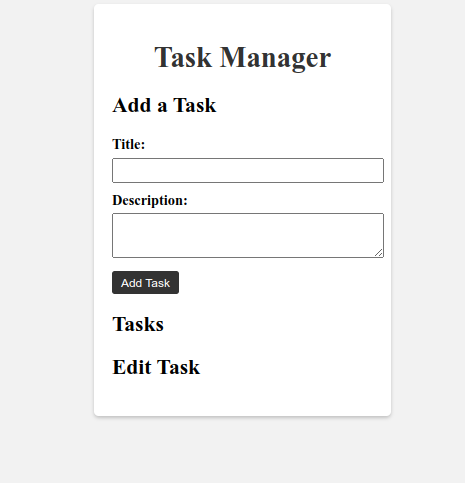

Thank you for providing the Git clone command. Below is an updated version of the README file based on the provided repository:

# VanillaJS CRUD App

VanillaJS CRUD App is a simple web application built with vanilla JavaScript that demonstrates CRUD (Create, Read, Update, Delete) functionality. It allows users to manage tasks by adding, viewing, updating, and deleting them.



## Features

- Create new tasks by providing a title and description.
- View a list of tasks with their titles and descriptions.
- Edit the title and description of existing tasks.
- Delete tasks from the list.

## Technologies Used

The VanillaJS CRUD App is built using the following technologies:

- HTML: Markup language for structuring the application's user interface.
- CSS: Stylesheets for visual styling and layout of the application.
- JavaScript: Programming language for implementing the application's logic and functionality.

## Getting Started

To run the VanillaJS CRUD App locally, follow these steps:

1. Clone the repository:

   ```bash
   git clone git@github.com:Vitalis-Maina/vanillaJs-CRUD-app.git
   ```

2. Navigate to the project directory:

   ```bash
   cd vanillaJs-CRUD-app
   ```

3. Open the `index.html` file in your web browser.

## Usage

- To add a new task, enter a title and description in the "Add a Task" section and click the "Add Task" button.
- The tasks will be displayed in the "Tasks" section, showing the title and description.
- To edit a task, click the "Edit" button next to the task you want to modify. Enter the updated title and description in the form that appears, then click the "Update Task" button.
- To delete a task, click the "Delete" button next to the task you want to remove.

## Contributions

Contributions to the VanillaJS CRUD App are welcome! If you find any issues or have suggestions for improvements, please feel free to submit an issue or a pull request.

## License

This project is licensed under the [MIT License](LICENSE).

## Acknowledgements

- This application was created as a demonstration of CRUD functionality using vanilla JavaScript.
- The design and implementation of the application are credited to Vitalis Maina.

---

That's an updated README file based on the provided Git repository. You can further modify it to include any additional information or sections specific to your project.
